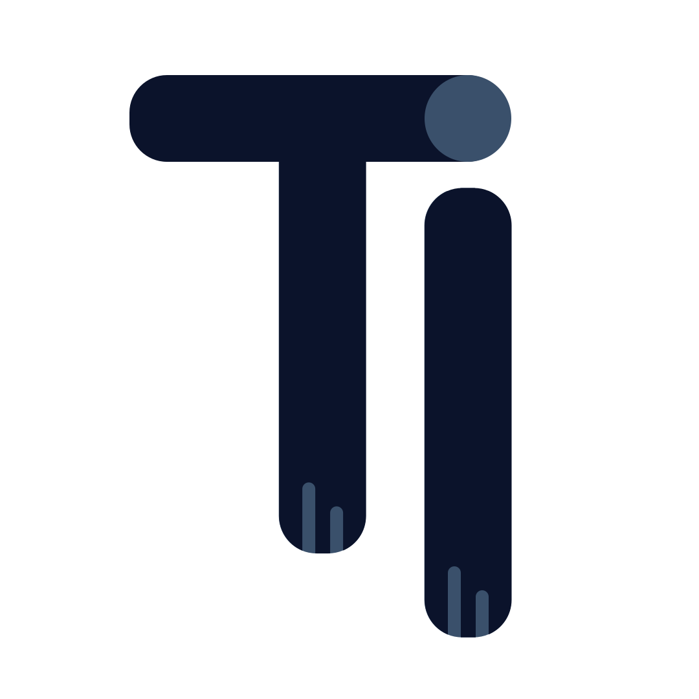

<!--
*** Thanks for checking out the Best-README-Template. If you have a suggestion
*** that would make this better, please fork the InfoTech and create a pull request
*** or simply open an issue with the tag "enhancement".
*** Thanks again! Now go create something AMAZING! :D
***
***
***
*** To avoid retyping too much info. Do a search and replace for the following:
*** valentindoche, InfoTech, @valentindoche, contact@valentindoche.com, InfoTech, project_description
-->

<!-- PROJECT SHIELDS -->
<!--
*** I'm using markdown "reference style" links for readability.
*** Reference links are enclosed in brackets [ ] instead of parentheses ( ).
*** See the bottom of this document for the declaration of the reference variables
*** for contributors-url, forks-url, etc. This is an optional, concise syntax you may use.
*** https://www.markdownguide.org/basic-syntax/#reference-style-links
-->
[![Contributors][contributors-shield]][contributors-url]
[![Forks][forks-shield]][forks-url]
[![Stargazers][stars-shield]][stars-url]
[![Issues][issues-shield]][issues-url]
[![MIT License][license-shield]][license-url]
[![LinkedIn][linkedin-shield]][linkedin-url]

<!-- PROJECT LOGO -->
 

  

  <h3 align="center">InfoTech</h3>

  

    An app made to find infos, courses and job opportunities about a programming language
     
     
     
    <a href="https://github.com/valentindoche/InfoTech">View Demo</a>
    ·
    <a href="https://github.com/valentindoche/InfoTech/issues">InfoTech Bug</a>
    ·
    <a href="https://github.com/valentindoche/InfoTech/issues">Request Feature</a>
  

<!-- TABLE OF CONTENTS -->

  
<h2 style="display: inline-block">Table of Contents</h2>

COMING SOON

<!-- MARKDOWN LINKS & IMAGES -->
<!-- https://www.markdownguide.org/basic-syntax/#reference-style-links -->
[contributors-shield]: https://img.shields.io/github/contributors/valentindoche/InfoTech.svg?style=for-the-badge
[contributors-url]: https://github.com/valentindoche/InfoTech/graphs/contributors
[forks-shield]: https://img.shields.io/github/forks/valentindoche/InfoTech.svg?style=for-the-badge
[forks-url]: https://github.com/valentindoche/InfoTech/network/members
[stars-shield]: https://img.shields.io/github/stars/valentindoche/InfoTech.svg?style=for-the-badge
[stars-url]: https://github.com/valentindoche/InfoTech/stargazers
[issues-shield]: https://img.shields.io/github/issues/valentindoche/InfoTech.svg?style=for-the-badge
[issues-url]: https://github.com/valentindoche/InfoTech/issues
[license-shield]: https://img.shields.io/github/license/valentindoche/InfoTech.svg?style=for-the-badge
[license-url]: https://github.com/valentindoche/InfoTech/blob/master/LICENSE.txt
[linkedin-shield]: https://img.shields.io/badge/-LinkedIn-black.svg?style=for-the-badge&logo=linkedin&colorB=555
[linkedin-url]: https://linkedin.com/in/valentindoche